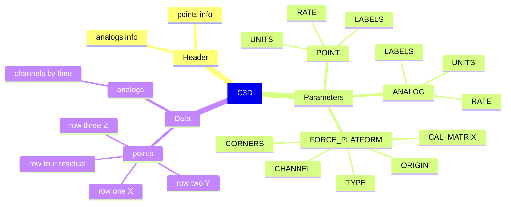
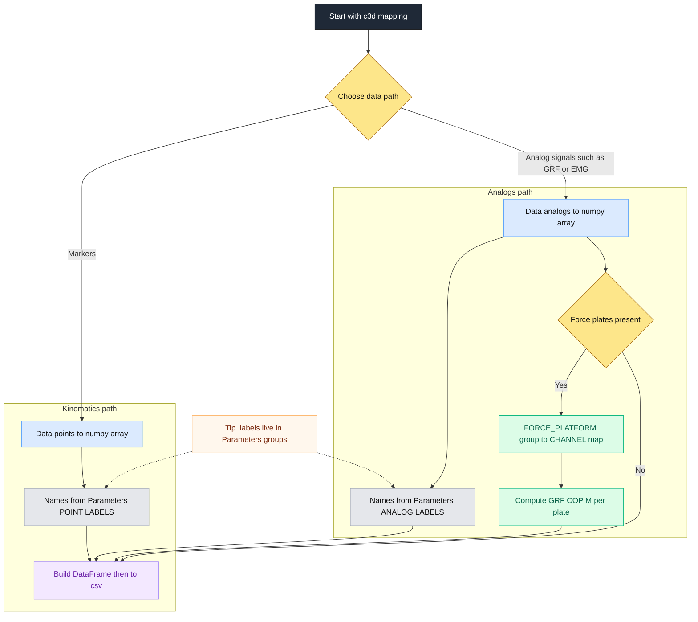

# C3D appendix

## C3D at a glance
**What it is**  
A single binary file that stores a motion trial. Three big parts.

- **Header**  
  Frame rates and counts for points and analogs

- **Parameters**  
  Named groups for metadata such as labels, units, rates, force plate setup

- **Data**  
  Two arrays  
  points shape 4 by N by T  
  analogs shape 1 by C by T

**What those shapes mean**  
- Points rows one to three are X Y Z  
- Points row four is residual or gap quality  
- N is number of markers  
- C is number of analog channels  
- T is number of time samples

**Units and rates**  
- Marker units often mm  
- Analog units vary  
- Analog rate to point rate is usually an integer ratio such as four or eight

---

## How to peek inside fast
- **List groups**  
  Parameters keys such as POINT  ANALOG  FORCE_PLATFORM

- **Marker labels**  
  Parameters  POINT  LABELS

- **Analog labels**  
  Parameters  ANALOG  LABELS

- **Units**  
  Parameters  POINT  UNITS and ANALOG  UNITS

- **Rates**  
  Parameters  POINT  RATE and ANALOG  RATE  
  If missing use header points frame_rate and header analogs frame_rate

- **Shapes**  
  Data points shape and Data analogs shape

- **Force plates**  
  Parameters  FORCE_PLATFORM keys to check  
  TYPE  CORNERS  ORIGIN  CHANNEL  CAL_MATRIX

---

## Common pitfalls and fixes
- Labels count does not match data count  
  Truncate or pad names so counts match

- Labels stored as bytes  
  Decode to utf-8

- Analogs shaped C by T  
  Add a leading axis so it becomes 1 by C by T

- Force plate channels use one based indexing  
  Subtract one when selecting columns in a DataFrame

- Units not standard  
  Check SCALE and lab notes before computing moments and CoP

- Coordinate frames differ across systems  
  Confirm lab axis directions before reporting results

---

## Sanity checks
- Analog samples equal point frames times rate ratio  
  T_analog equals T_point times analog_rate divided by point_rate

- Marker count equals number of labels  
  N equals length of Parameters  POINT  LABELS

- Each plate has at least six channels  
  Fx  Fy  Fz  Mx  My  Mz

---

## Tiny map of a C3D file

---

## Quick recipes
- **Markers to a wide table**  
  Columns use name underscore X Y Z  
  Index is frame number

- **Analogs to a table**  
  Columns use channel labels  
  Index is sample number

- **Force from plates**  
  Map CHANNEL to Fx Fy Fz Mx My Mz columns  
  Compute CoP as minus My over Fz and plus Mx over Fz with a small Fz threshold

---

## Flow from file to tables

